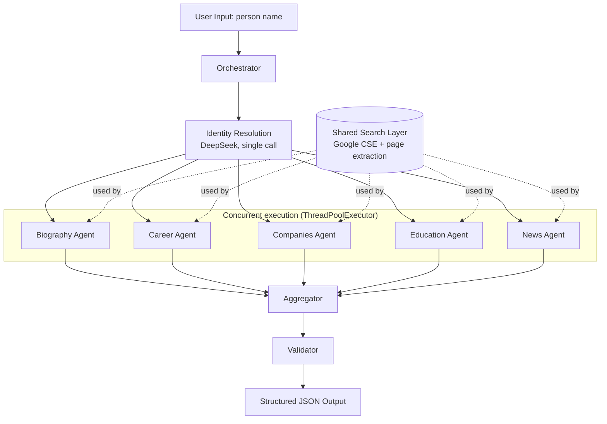

# Person Research System

A multi-agent pipeline that turns a person's name into an evidence-backed,
structured research profile. It decomposes person-level research into
independent specialized agents, executes their research tasks
concurrently, and aggregates the results into one structured profile.

## 1. Overview

Given a name, the system resolves who the target actually is, then
researches five categories — biography, career, companies, education, and
news — in parallel, each backed by live web search and page content, not
model memory. Every claim in the output is traceable to a source URL the
pipeline actually fetched and an AI relevance check actually approved.

## 2. Problem Statement

Person research done by hand (or by a single LLM prompt) has two
recurring failure modes:

- **Identity collisions.** Common names return sources about the wrong
  person, and a model with no disambiguation step will happily blend
  them.
- **Unstructured, sequential effort.** Researching biography, career,
  companies, education, and news one after another is slow and produces
  an unstructured blob rather than a reviewable, structured record.

This system addresses both: an upfront identity-resolution step
constrains every downstream query and evaluation, and the five research
categories are decomposed into independent agents that run concurrently
and each return their own structured, source-attributed section.

## 3. Architecture



Each agent, independently:
1. Builds its own search queries from the person's name, its objective,
   and (for education) an identity-derived disambiguation anchor.
2. Uses the shared search layer to run rounds of Google Custom Search,
   fetch and clean candidate pages, and have an LLM judge identity match
   and topical relevance per candidate — up to 3 approved sources or 5
   search rounds, whichever comes first.
3. Synthesizes its own structured JSON section from only its own approved
   sources.

## 4. System Flow

1. User provides a person's name (CLI arg or prompt).
2. Orchestrator resolves target identity once (disambiguation signals,
   likely professional identity) — shared by every agent below.
3. Orchestrator submits all 5 agents to a thread pool; each runs its full
   search → evaluate → synthesize cycle independently.
4. Orchestrator collects each agent's outcome (success + data, or
   isolated failure) as futures complete.
5. Aggregator combines the five outcomes into one profile, deduplicates
   sources shared across agents, and records which agents failed.
6. Validator checks structural integrity and JSON-serializability.
7. Result is printed as a summary and saved as JSON under `outputs/`.

## 5. Specialized Agents

| Agent | Module | Responsibility |
|---|---|---|
| Biography | `agents/biography_agent.py` | Early life, background, milestones |
| Career | `agents/career_agent.py` | Roles, employment history, career progression |
| Companies | `agents/companies_agent.py` | Founded / co-founded / led companies |
| Education | `agents/education_agent.py` | Degrees, institutions, academic background |
| News | `agents/news_agent.py` | Recent developments, announcements |

Each agent module defines only what's specific to it — objective text,
query templates, and its output schema fields — and delegates search
mechanics to `utils/search.py` and LLM calls to `utils/llm_client.py`.
Every agent exposes the same interface: `run(person_name, identity_profile) -> dict`
with `data`, `sources`, `rejected_count`, `search_rounds_used`.

## 6. Parallel Execution Strategy

Research is I/O-bound (HTTP requests to Google, page fetches, DeepSeek
API calls), so `core/orchestrator.py` uses
`concurrent.futures.ThreadPoolExecutor` with one worker per agent and
`as_completed` to collect results as they finish. This preserves the
concurrency model of the original implementation while extending it
uniformly across all 5 agents.

Measured on a real run (`python main.py "Neil Patel"`):

| Agent | Duration |
|---|---|
| biography | 27.6s |
| companies | 27.7s |
| news | 81.8s |
| career | 117.7s |
| education | 133.0s |
| **Sum (sequential estimate)** | **387.8s** |
| **Actual wall time (parallel)** | **133.0s** |

Running concurrently took as long as the single slowest agent, not the
sum of all five — roughly a 2.9x speedup over sequential execution in
this run.

## 7. Aggregation and Validation

`core/aggregator.py` performs no research — it only:
- nests each agent's `data` under `research.<agent_name>`,
- deduplicates sources across agents by URL and strips the large
  extracted page text before writing to disk (attribution is kept:
  URL, domain, title, relevance scores; full text is dropped),
- records per-agent duration and which agents failed.

`core/validator.py` checks structure only — it never invents or fills in
missing data:
- required top-level fields exist (`person`, `research`, `sources`, `metadata`),
- each of the 5 expected agent sections is present with a `status`,
- a `failed` section carries an `error`; a `success` section carries `data`,
- `metadata.failed_agents` matches the sections actually marked failed,
- the whole result round-trips through `json.dumps`.

Validation issues are logged as warnings, not thrown — a structurally
imperfect result is still saved and reported, per the failure-isolation
requirement below.

## 8. Error Handling

Each agent runs inside its own `try/except` in
`core/orchestrator.py::_run_single_agent`. A single agent raising an
exception:
- is caught and turned into a `status: "failed"` outcome with the error
  message preserved,
- is logged at `ERROR` level with the agent name and elapsed time,
- does **not** cancel or block the other agents' futures.

Verified directly: a simulated failure in the education agent still
produced a complete profile with `research.education.status == "failed"`
and the error message intact, while the other four agents completed
normally and `metadata.failed_agents == ["education"]`.

## 9. Technology Stack

- **Python 3.10+** (uses `X | None` union syntax)
- **Google Custom Search API** — web search
- **DeepSeek (`deepseek-chat`) via the OpenAI SDK** — identity resolution,
  source relevance evaluation, per-agent synthesis
- **`requests` + `BeautifulSoup4`** — page fetching and text extraction
- **`concurrent.futures.ThreadPoolExecutor`** — agent concurrency
- **`python-dotenv`** — environment configuration

No web framework, task queue, or agent framework is used — the pipeline
is a single-process CLI, which matches its actual scale.

## 10. Project Structure

```
person_research_system/
├── agents/
│   ├── __init__.py
│   ├── biography_agent.py
│   ├── career_agent.py
│   ├── companies_agent.py
│   ├── education_agent.py
│   └── news_agent.py
├── core/
│   ├── __init__.py
│   ├── orchestrator.py      # identity resolution + parallel agent launch
│   ├── aggregator.py        # combine agent outcomes, dedupe sources
│   └── validator.py         # structural validation, no invented data
├── utils/
│   ├── __init__.py
│   ├── search.py            # Google search, page extraction, gather_sources()
│   └── llm_client.py        # DeepSeek client, identity + relevance + synthesis
├── outputs/
│   └── .gitkeep
├── config.py                 # env vars + tuning constants (single source of truth)
├── main.py                   # CLI entry point
├── .env.example
├── .gitignore
├── requirements.txt
└── README.md
```

## 11. Setup

```bash
python -m venv .venv
.venv\Scripts\activate        # Windows
# source .venv/bin/activate   # macOS/Linux

pip install -r requirements.txt
cp .env.example .env          # then fill in real credentials
```

## 12. Environment Variables

Set these in `.env` (never committed — see `.gitignore`):

| Variable | Purpose |
|---|---|
| `GOOGLE_API_KEY` | Google Custom Search API key |
| `GOOGLE_CSE_ID` | Google Programmable Search Engine ID |
| `DEEPSEEK_API_KEY` | DeepSeek API key (identity, evaluation, synthesis) |

`config.validate_environment()` fails fast with a clear message if any
are missing.

## 13. Usage

```bash
python main.py "Neil Patel"
# or, interactively:
python main.py
```

The pipeline logs identity resolution, each agent's start/finish (with
duration and source count), and any failures, then prints a summary
table and writes the full result to `outputs/<name>_<timestamp>.json`.

## 14. Example Output

```json
{
  "person": "Neil Patel",
  "identity_profile": {
    "target_name": "Neil Patel",
    "ambiguous_name": true,
    "likely_professional_identity": "digital marketing entrepreneur, co-founder of NP Digital",
    "confidence": 8
  },
  "research": {
    "biography": {
      "status": "success",
      "data": {
        "early_life": "...",
        "background": "...",
        "major_milestones": ["..."],
        "summary": "...",
        "uncertainties": [],
        "identity_warnings": []
      },
      "source_count": 3,
      "rejected_count": 11,
      "search_rounds_used": 2
    },
    "career": { "status": "success", "data": { "...": "..." } },
    "companies": { "status": "success", "data": { "companies": [ { "name": "KISSmetrics", "relationship": "co-founded" } ] } },
    "education": { "status": "success", "data": { "...": "..." } },
    "news": { "status": "success", "data": { "...": "..." } }
  },
  "sources": [
    { "agent": "biography_agent", "url": "https://neilpatel.com/about/", "identity_match": 9, "overall_score": 9 }
  ],
  "metadata": {
    "timestamp": "20260817_104728",
    "agents": ["biography", "career", "companies", "education", "news"],
    "failed_agents": [],
    "agent_durations_seconds": { "biography": 27.6, "career": 117.7 },
    "total_duration_seconds": 132.98
  }
}
```

## 15. Engineering Decisions / Trade-offs

- **Per-agent synthesis, not one mega-synthesis.** The prior
  implementation collected sources per category but ran a single
  DeepSeek call over *all* sources combined to produce the whole
  profile. That call is real research work, so leaving it as a shared
  final step would have meant the aggregator (or some 6th component)
  performing research — contradicting the requirement that the
  aggregator only combines. Each agent now synthesizes its own section
  from only its own sources. Trade-off: an agent can no longer draw on
  another agent's sources (e.g. a company bio mentioned in a news
  article) — sections are more independent but slightly less
  cross-pollinated than before.
- **Identity resolution is a shared pre-step, not a 6th agent.** The
  original code had `identity_agent` as a parallel source-collecting
  agent alongside a separate upfront `build_identity_profile` call — a
  duplication. The refactor keeps only the upfront identity-resolution
  call, run once before the 5 required agents, since every agent needs
  the same identity profile to disambiguate.
- **`ThreadPoolExecutor` over `asyncio`.** The workload is I/O-bound but
  built on synchronous `requests` and the synchronous OpenAI SDK client;
  a thread pool gets the concurrency win without an async rewrite of the
  HTTP/LLM call stack, and matches what the original implementation
  already used.
- **Generalized identity/evaluation rules.** The original prompts
  hardcoded example names (e.g. "a source about X is not about Y") from
  whatever person the developer last tested. The refactor generalizes
  these into person-agnostic rules ("do not merge people with the same
  name") so the same code behaves consistently for any target.
- **Full page text dropped from saved output.** The original JSON output
  included the full extracted page text for every source inside
  `agent_results`, producing 300–400KB files. The refactor keeps
  attribution (URL, domain, title, scores) but drops the text blob from
  the saved result, since it isn't needed once synthesis has run.
- **Config centralized in `config.py`.** Environment variables and
  tuning constants (thresholds, round/source targets, domain
  allow/block lists) were previously read inline. They're now a single
  module every other layer imports, so there's one place to change
  behavior and no per-file `os.getenv` calls.

## 16. License

MIT — see [LICENSE](LICENSE).

## 17. Future Improvements

- Cross-agent context sharing (e.g. letting the biography agent see a
  company name the companies agent already confirmed) without
  reintroducing a shared mega-synthesis step.
- Configurable agent selection (run a subset of the 5 categories).
- Pluggable search/LLM providers behind the same `utils` interfaces.
- Persisting rejected sources and evaluation reasoning to the output for
  auditability (currently only counted, not itemized, per agent).
- Retry/backoff for transient search or LLM failures before marking an
  agent as failed.
